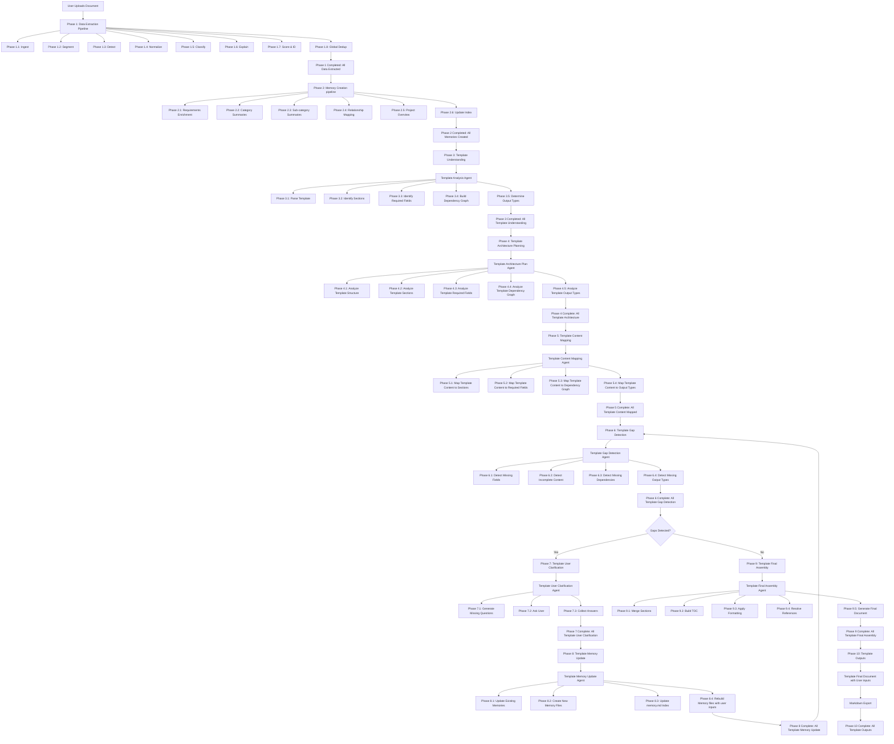

# Global Architecture Plan: End-to-End Documentation Pipeline

This document explains the complete, 10-phase automated document generation pipeline. It describes how raw input specifications are digested, enriched, mapped to targets, and compiled into fully stylized, validated final documents.

---

## Global Pipeline Overview

The system is structured as an interactive multi-agent system. Below is a high-level summary of the 10 phases:

| Phase | Name | Focus | Key Output |
| :--- | :--- | :--- | :--- |
| **1** | **Data Extraction Pipeline** | Page-by-page document ingestion & cleaning | Clean, deduplicated raw requirement list |
| **2** | **Memory Creation Pipeline** | Contextual enrichment and summary building | Enriched Memory Store (Markdown files) |
| **3** | **Template Understanding** | Analyzing target outlines and required blanks | Section outline & DAG dependency graph |
| **4** | **Template Architecture Planning**| Creating target structural execution blueprints | Target document architecture roadmap |
| **5** | **Template Content Mapping** | Binding extracted memories to template slots | Fully mapped template schema |
| **6** | **Template Gap Detection** | Checking for missing information or rules | Checklist of missing fields/unresolved gaps |
| **7** | **Template User Clarification** | Prompting the user to answer missing questions | User feedback & collected answers |
| **8** | **Template Memory Update** | Updating memories with user answers | Refreshed, complete Memory Store (loops back) |
| **9** | **Template Final Assembly** | Compiling, formatting, and linking sections | Integrated final draft document |
| **10**| **Template Outputs** | Formatting and exporting the finished files | Markdown, PDF, and DOCX final files |

---

## Detailed Phase Explanations

### Phase 1: Data Extraction Pipeline (Phases 1.1 - 1.8)
* **Goal:** Convert raw, messy technical specification PDFs or images into normalized, classified requirements.
* **Mechanism:**
  * Extracts raw text and tables using parser tools (Stage 1.1).
  * Chunks text logically, scores and isolates technical statements (Stages 1.2 - 1.3).
  * Standardizes engineering grammar ("shall") and classifies requirements by technical domain (Stages 1.4 - 1.5).
  * Generates descriptive context, assigns unique IDs, and deduplicates identical rules globally (Stages 1.6 - 1.8).

### Phase 2: Memory Creation Pipeline (Phases 2.1 - 2.6)
* **Goal:** Turn the flat requirements catalog into a structured knowledge base (Memory Store).
* **Mechanism:**
  * Rewrites each requirement into a detailed markdown specification sheet (Phase 2.1).
  * Generates high-level summaries by category and subcategory (Phases 2.2 - 2.3).
  * Maps relationships and dependencies between hardware rails, clocks, and software interfaces (Phase 2.4).
  * Compiles a central directory index file (`MEMORY.md`) (Phases 2.5 - 2.6).

### Phase 3: Template Understanding (Phases 3.1 - 3.5)
* **Goal:** Parse blank target templates to understand what the user wants to generate.
* **Mechanism:**
  * Uses the **Template Analysis Agent** to break down the blank template's outline and headings (Phases 3.1 - 3.2).
  * Extracts placeholder variables and builds a Directed Acyclic Graph (DAG) of section dependencies (Phases 3.3 - 3.4).
  * Determines target export output types (Phase 3.5).

### Phase 4: Template Architecture Planning (Phases 4.1 - 4.5)
* **Goal:** Design a blueprint detailing *how* the document will be built.
* **Mechanism:**
  * Uses the **Template Architecture Plan Agent** to analyze the structures, required fields, and DAG dependency graph (Phases 4.1 - 4.4).
  * Schedules the compilation order and defines the layout formatting configurations (Phase 4.5).

### Phase 5: Template Content Mapping (Phases 5.1 - 5.4)
* **Goal:** Map the saved memories to the target template locations.
* **Mechanism:**
  * The **Template Content Mapping Agent** aligns the enriched requirements from Phase 2 with the section variables and placeholders identified in Phase 3.

### Phase 6: Template Gap Detection (Phases 6.1 - 6.4)
* **Goal:** Identify any missing data or broken dependencies before generating text.
* **Mechanism:**
  * The **Template Gap Detection Agent** checks for missing fields, incomplete descriptions, or unfulfilled dependency links.
  * If gaps are found, it sets the `Gaps Detected?` flag to **Yes**, routing the flow to Phase 7. If no gaps exist, it routes to Phase 9.

### Phase 7: Template User Clarification (Phases 7.1 - 7.3)
* **Goal:** Interactively ask the user for missing details.
* **Mechanism:**
  * The **Template User Clarification Agent** compiles all gaps into clear questions, asks the user, and collects their answers.

### Phase 8: Template Memory Update (Phases 8.1 - 8.4)
* **Goal:** Update the knowledge base with the user's answers.
* **Mechanism:**
  * The **Template Memory Update Agent** writes the user's responses into the corresponding memory markdown files, index lists, and vector databases.
  * Once updated, **the pipeline loops back to Phase 6 (Gap Detection)** to verify that all gaps are resolved.

### Phase 9: Template Final Assembly (Phases 9.1 - 9.5)
* **Goal:** Compile all mapped sections into a single draft.
* **Mechanism:**
  * The **Template Final Assembly Agent** merges the individual generated sections, constructs the Table of Contents, applies styling rules, and resolves cross-references.

### Phase 10: Template Outputs (Phases 10.1 - 10.3)
* **Goal:** Export the completed document into final, distribution-ready formats.
* **Mechanism:**
  * Generates the final document with user-clarified parameters and exports it to standard Markdown, DOCX, or PDF formats.

---

## Architectural Best Practices & Mentor Notes

Keep these design principles in mind as you build out the implementation:

### 1. The Closed-Loop Verification Loop
Routing Phase 8 back to Phase 6 prevents incomplete documents from being compiled. In software architecture, this is called **Continuous Validation**. By re-running gap detection after updates, the agent guarantees that the document meets all quality criteria before assembly starts.

### 2. Idempotent State Updates
Because the loop between Phases 6, 7, and 8 can run multiple times, the **Memory Update Agent (Phase 8)** must be idempotent. Every time it writes user inputs to a markdown file, it must overwrite existing keys or append fresh entries without duplicating existing parameters.

### 3. Fail-Fast Planning
Phases 5 and 6 act as early gates. If a system variable is missing, it is much cheaper to find it and ask the user in Phase 7 *before* invoking heavy LLM generation tasks in Phase 9.
