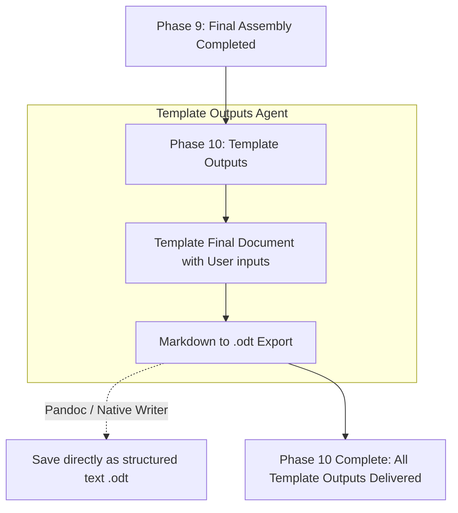

# Phase 10: Template Outputs

This document explains the Template Outputs phase. This is the final phase in the entire 10-phase pipeline. After the document is completely assembled and formatted, this phase handles the translation and export of the file into formats the user can download and share with their teams.

---

## Phase Overview

| Phase | Name | What it does in simple terms | Output Asset |
| :--- | :--- | :--- | :--- |
| **M1** | **Template Final Document** | Stages the final verified text for export. | Staging Buffer |
| **M2** | **Markdown to .odt Export** | Converts the markdown into an editable OpenDocument Text file using Pandoc. | `.odt` File |

---

## Detailed Phase-by-Phase Slides

### Phase M1: Template Final Document with User Inputs

1. **What this stage is doing:**
   * It takes the golden master copy from Phase 9 (which includes all the memory updates generated by user clarifications from Phase 7) and loads it into the export staging area.
2. **How it is useful:**
   * It isolates the generation engine from the export engine.
3. **What is solved in this stage:**
   * **The Corruption Problem:** Ensures that if a document exporter crashes, it doesn't destroy the generated markdown text.

### Phase M2: Markdown to .odt Export (Pandoc)

1. **What this stage is doing:**
   * It uses `pandoc` to convert the standard `.md` file into an OpenDocument Text (`.odt`) file format.
2. **How it is useful:**
   * ODT is an open, editable word processor format supported by LibreOffice, Google Docs, and Microsoft Word.
3. **What is solved in this stage:**
   * **The Vendor Lock-in Problem:** Ensures the generated document isn't trapped in a developer-only markdown format or a proprietary Microsoft format, making it accessible to the entire enterprise for editing and review.

---

## Mentor Notes: Potential Problems & Solutions

### 1. Complex Table Formatting in ODT
* **The Problem:** When converting markdown to ODT with Pandoc, complex engineering tables (like hardware pinouts) might lose column width constraints or styling rules.
* **The Easy Solution:** Use a **Pandoc Reference Document**. Create a pre-styled, blank `.odt` file that contains your desired table styles, fonts, and headers. Run Pandoc with the `--reference-doc=template.odt` flag. This guarantees that your large specification tables stay neat and perfectly aligned to your company's visual identity!
