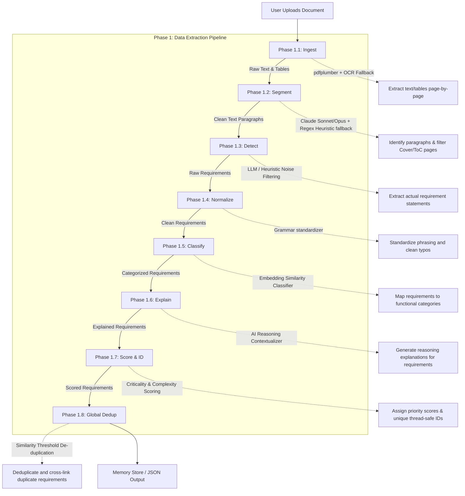

# Phase 1: Data Extraction Pipeline

This document explains the 8-phase data extraction pipeline, focusing on how the system extracts and processes **embedded systems technical documents** (such as Technical Specification documents, System Requirements Specifications [SyRS], and Hardware Requirements Specifications [HRS]). It is structured to help you present each phase clearly using simple words, enriched with the actual rules, metrics, and categories defined in the system prompts.

---

## Phase Overview

| Phase | Name | What it does in simple terms | Key Metrics and Logic |
| :--- | :--- | :--- | :--- |
| **1.1** | **Ingest** | Reads Technical Specifications, SyRS, or HRS documents and extracts text, register tables, and requirements. | Extracts text/tables page-by-page. Fallback to OCR if page text < 50 chars. |
| **1.2** | **Segment** | Splits text into logical hardware and software blocks and skips page headers, footers, or revision logs. | Merges bullet lists. Splits text > 400 chars. Detects Cover & ToC pages. |
| **1.3** | **Detect** | Filters out introductory talk and isolates actual firmware, software, and hardware rules. | Scores text from 0 to 10. Filters rules based on technical units and directive verbs. |
| **1.4** | **Normalize** | Standardizes how register names, bit flags, and pin connections are written in the requirements. | Replaces modal verbs with "shall". Removes vague language (e.g., "approximately"). |
| **1.5** | **Classify** | Automatically tags rules under categories like Power, Peripherals, Memory, or Clock. | Maps requirements into 16 specific Hardware, Software, and Non-Functional categories. |
| **1.6** | **Explain** | Explains the physical hardware logic and reasons behind register bit and pin configurations. | Generates clear explanations for Meaning, Components, Parameters, and Purpose. |
| **1.7** | **Score & ID** | Rates how critical a rule is (like timing constraints) and assigns unique tracking IDs. | Extracts 3-8 keywords and scores confidence (0.2 to 1.0) based on directives and units. |
| **1.8** | **Global Dedup** | Merges duplicate register and requirement descriptions across different sections of the document. | Checks similarity between requirements to merge identical rules into a single source. |

---

## Detailed Phase-by-Phase Slides

### Phase 1.1: Ingest

1. **What this stage is doing:**
   * It reads the uploaded embedded systems technical document (such as a Technical Specification, SyRS, or HRS) page by page. It extracts text, pin configuration charts, register maps, and hardware requirements tables.
   * If a page has very little selectable text (less than 50 characters), it automatically runs OCR image processing to extract text from the visual layout.
2. **How it is useful:**
   * It ensures the system can read and parse any requirement format, from digital PDF specifications to scanned hardware schematics and paper datasheets.
3. **What is solved in this stage:**
   * **The Scanned Document Problem:** It prevents blank pages or unreadable print layers from breaking the pipeline. All text and tables are captured, ensuring no raw requirement is ignored.

---

### Phase 1.2: Segment

1. **What this stage is doing:**
   * It groups the raw text into logical paragraph chunks.
   * **Rule 1 (Merge Lists):** It merges multi-line bullet points or numbered lists into a single continuous statement.
   * **Rule 2 (Join Lines):** It joins split lines that start with lowercase letters back into the previous sentence.
   * **Rule 3 (Split Paragraphs):** It splits very long paragraphs (greater than 400 characters) at sentence boundaries to isolate separate requirements.
   * **Rule 4 (Filter Cover/ToC):** It automatically identifies and skips Cover pages or Table of Contents (ToC) sections to focus only on technical content.
2. **How it is useful:**
   * It cleans the text stream so the AI only processes actual hardware registers, interfaces, and system rules, reducing model costs and context load.
3. **What is solved in this stage:**
   * **The Formatting Noise Problem:** It cleans up page numbers, footer text, copyright lines, and broken sentence splits that standard PDF converters create.

---

### Phase 1.3: Detect

1. **What this stage is doing:**
   * It scores each text segment from 0 to 10 to decide if it is a real technical requirement:
     * **+5 Points:** Contains strong directives like "shall" or "must".
     * **+3 Points:** Contains moderate directives like "will", "should", "required", "mandatory", "supports", or "defines".
     * **+3 Points:** Contains technical units (voltages, current, power, clock speed, data sizes, timings, temperatures).
     * **+2 Points:** Mentions hardware protocols (UART, SPI, I2C, CAN, PCIe, USB, Ethernet, LVDS, GPIO, etc.).
     * **-2 Points:** Starts with meta-text like "this document" or "this section".
     * **-1 Point:** Contains vague words like "e.g.", "etc.", or "approximately".
   * **Filtering Thresholds:** Segments without technical units must score 4 or higher to pass. Segments with technical units pass if they score 3 or higher. Strong directives ("shall" / "must") are passed automatically.
2. **How it is useful:**
   * It isolates actionable hardware instructions from general introductory commentary.
3. **What is solved in this stage:**
   * **The Information Clutter Problem:** It filters out background stories, copyright notices, document meta (like "prepared by"), figure captions, and blank lines, leaving only true requirements.

---

### Phase 1.4: Normalize

1. **What this stage is doing:**
   * It cleans up requirement phrasing into a standard engineering layout:
     * **Rule 1:** Replaces all weak modal verbs (will, should, must, required, specifies) with the formal engineering term **"shall"**.
     * **Rule 2:** Removes ambiguous words (like "approximately", "as needed", "as applicable", "if necessary").
     * **Rule 3:** Capitalizes sentences, collapses double spaces, and preserves register IDs and technical numbers exactly as-is.
2. **How it is useful:**
   * It makes requirements easy to read and trace by standardizing the phrasing of every instruction.
3. **What is solved in this stage:**
   * **The Author Inconsistency Problem:** It aligns writing styles from multiple authors. For example, it normalizes *"The system should support SPI interface, approximately 10MHz"* into *"The system shall support SPI interface, 10MHz."*

---

### Phase 1.5: Classify

1. **What this stage is doing:**
   * It categorizes every requirement into exactly one specific domain:
     * **Hardware/Power:** Voltage rails, buck/boost regulators, power consumption.
     * **Hardware/Memory:** DDR, Flash, SRAM, MRAM, eMMC.
     * **Hardware/Processor:** ARM, CPU, MCU, RISC-V, SoC cores.
     * **Hardware/FPGA:** LUTs, ASIC, bitstream, RTL, Vivado.
     * **Hardware/Interface:** UART, SPI, I2C, CAN, GPIO, PCIe, JTAG.
     * **Hardware/Clock:** Oscillators, PLLs, timing, TCXO.
     * **Hardware/Environmental:** Operating temperature, vibration, IP rating, EMC/EMI.
     * **Hardware/Mechanical:** Dimensions, weight, heatsink, mounting.
     * **Software/Firmware:** Bootloaders, RTOS, HAL, bare-metal code.
     * **Software/Driver:** Kernel modules, interrupts, ISRs, u-boot.
     * **Software/Application:** API, REST, GUI, SDKs.
     * **Non-Functional/Safety:** Watchdogs, ISO 26262, SIL, fail-safe modes.
     * **Non-Functional/Security:** Secure boot, encryption, TLS, AES.
     * **Non-Functional/Performance:** Latency, throughput, real-time constraints.
     * **Functional:** General system behavior and operations.
2. **How it is useful:**
   * It automatically groups data points by engineering disciplines so different teams (hardware, firmware, QA) can find their specific tasks instantly.
3. **What is solved in this stage:**
   * **The Manual Sorting Bottleneck:** Developers no longer have to read through hundreds of requirements to group them into folders. The classification model handles this automatically.

---

### Phase 1.6: Explain

1. **What this stage is doing:**
   * It generates a structured technical explanation for each requirement, including:
     * **Meaning:** A simple description of what the requirement is asking for.
     * **Components (Optional):** The hardware chips, drivers, or interfaces involved.
     * **Parameters (Optional):** The exact voltages, timing limits, data rates, or standards mentioned.
     * **Purpose:** The hardware or system reason why the requirement is necessary.
2. **How it is useful:**
   * It acts as a bridge between high-level specs and actual code, giving developers clear design context.
3. **What is solved in this stage:**
   * **The Magic Numbers Problem:** It explains the logic behind registers or numbers (e.g., explaining that a bit configuration is needed to enable pull-up resistors on a specific bus), reducing coding errors.

---

### Phase 1.7: Score & ID

1. **What this stage is doing:**
   * It analyzes each requirement, extracts **3 to 8 lowercase keywords** representing the technical domain, and scores the confidence of extraction (base score 0.2, +0.2 for shall/must, +0.2 for technical units, +0.2 for interface protocols, +0.2 for specificity, capped at 1.0).
   * It then registers a unique serial ID (like REQ-001, REQ-002) in a thread-safe environment.
2. **How it is useful:**
   * It flags high-confidence requirements, maps keywords for search indexing, and assigns permanent IDs for requirement tracing.
3. **What is solved in this stage:**
   * **The ID Collision Problem:** Multi-page parallel extraction threads can assign overlapping IDs. Using thread-safe locking guarantees that every requirement gets a unique tracking number.

---

### Phase 1.8: Global Dedup

1. **What this stage is doing:**
   * It compares all requirements across the document. If two requirements describe the same measurable parameter, value, or behavior, it marks them as duplicates and merges them.
2. **How it is useful:**
   * It guarantees a clean requirement catalog where each unique hardware or firmware instruction is defined exactly once.
3. **What is solved in this stage:**
   * **The Specification Redundancy Problem:** In large documents, the same requirement is often repeated in different chapters (for example, in the general specifications, pin configurations, and peripheral setup). This stage consolidates them into a single source of truth.
