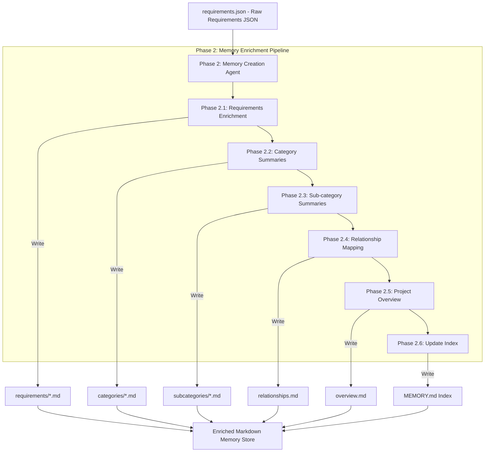

# Phase 2: Memory Creation Pipeline

This document explains the Memory Creation Pipeline based on the Memory orchestrator. It explains how raw extracted requirements data is enriched into structured Markdown files that serve as the knowledge base for document generation.

---

## Phase Overview

| Phase | Name | What it does in simple terms | Output Asset |
| :--- | :--- | :--- | :--- |
| **2.1** | **Requirements Enrichment** | Rewrites each raw requirement into a detailed markdown knowledge sheet. | `requirements/*.md` |
| **2.2** | **Category Summaries** | Groups requirements by engineering category and writes module overviews. | `categories/*.md` |
| **2.3** | **Subcategory Summaries** | Groups requirements into interface/protocol subgroups with summaries. | `subcategories/*.md` |
| **2.4** | **Relationship Mapping** | Creates dependency links and cross-references between related specifications. | `relationships.md` |
| **2.5** | **Project Overview** | Summarizes the entire project scope, constraints, and metrics. | `overview.md` |
| **2.6** | **Update Index** | Compiles a central table of contents index referencing all memory files. | `MEMORY.md` |

---

## Detailed Phase-by-Phase Slides

### Phase 2.1: Requirements Enrichment

1. **What this stage is doing:**
   * It takes each raw requirement from the extracted JSON and uses an LLM to rewrite it into a clean, comprehensive Markdown file.
   * It keeps the original requirement text exactly as-is, but enhances the explanation, creates an attributes table (Priority, Confidence, units, directives), lists keywords, and writes links to related files.
2. **How it is useful:**
   * It transforms raw requirements into structured individual knowledge sheets that other AI agents can read and understand in context during document generation.
3. **What is solved in this stage:**
   * **The Lack of Context Problem:** Raw requirements lack formatting and explanation. This stage adds detailed context and structured attributes so they are ready for document assembly.

---

### Phase 2.2: Category Summaries

1. **What this stage is doing:**
   * It groups requirements by top-level categories (such as Power, Clocks, or Memory) and uses the LLM to write a professional overview of what is covered in that category, along with a table linking to each requirement.
2. **How it is useful:**
   * It provides a high-level summary of each technical domain, which is crucial for generating introduction sections in final report chapters.
3. **What is solved in this stage:**
   * **The Information Fragmentation Problem:** Instead of having to look at dozens of individual requirements to understand what a section is about, this stage creates a clean summary table for the entire module.

---

### Phase 2.3: Sub-category Summaries

1. **What this stage is doing:**
   * It groups requirements further into specific sub-categories (like UART, SPI, or I2C under Hardware/Interface) and generates a focused summary for each sub-category group.
2. **How it is useful:**
   * It helps the document generator write detailed sub-sections by providing pre-grouped summaries of related interface protocols or software modules.
3. **What is solved in this stage:**
   * **The Manual Grouping Problem:** Automatically categorizes specifications, preventing mixed-topic sections in the final generated document.

---

### Phase 2.4: Relationship Mapping

1. **What this stage is doing:**
   * It uses an LLM to scan all requirements, find semantic relationships (like dependencies, component shares, or verification links), and map them into a relationships file.
   * If the LLM call fails, it uses a rule-based fallback based on keyword overlaps (e.g., sharing 3 or more keywords).
2. **How it is useful:**
   * It links related specifications together. If a developer modifications one requirement, they can instantly see which other requirements are affected.
3. **What is solved in this stage:**
   * **The Isolated Requirements Problem:** In complex documents, requirements are often connected but scattered. This stage builds the dependency links so you can trace what changes impact which other components.

---

### Phase 2.5: Project Overview

1. **What this stage is doing:**
   * It creates a global project summary file detailing the overall scope, category distributions, and project context.
2. **How it is useful:**
   * Serves as the introduction and overview content for the final generated document, providing context about the entire project.
3. **What is solved in this stage:**
   * **The Document Introduction Bottleneck:** Automatically drafts high-level project summaries, saving writers from having to summarize the document contents manually.

---

### Phase 2.6: Update Index

1. **What this stage is doing:**
   * It compiles a central index file (`MEMORY.md`) listing all requirements, categories, and subcategories with relative markdown links, along with processing stats.
   * If the LLM call fails, it automatically runs a static python indexing script to write the file.
2. **How it is useful:**
   * Acts as the main directory map of the entire memory store, allowing both human engineers and other AI agents to find and navigate files instantly.
3. **What is solved in this stage:**
   * **The Navigation Problem:** In a database containing hundreds of files, finding the right requirement sheet can be slow. This stage builds a structured directory map, making search and navigation instant.
