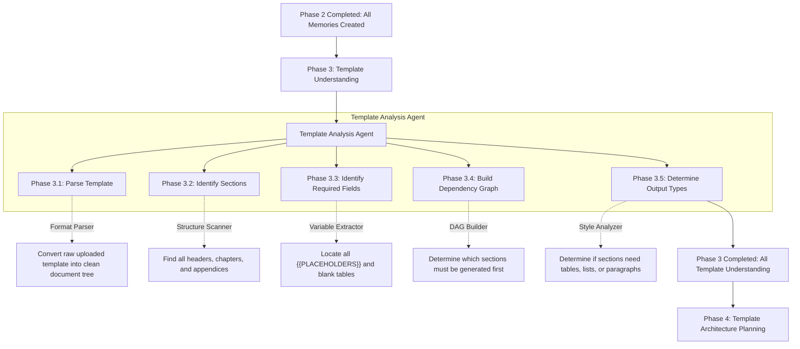

# Phase 3: Template Understanding

This document explains the Template Understanding phase. Before the system can generate a document, it must perfectly understand the empty template the user wants to fill. This phase acts as a "Blueprint Scanner."

---

## Phase Overview

| Phase | Name | What it does in simple terms | Output Asset |
| :--- | :--- | :--- | :--- |
| **3.1** | **Parse Template** | Reads the raw uploaded template (like a blank `.docx` or `.md` file). | Document Tree |
| **3.2** | **Identify Sections** | Finds all the chapters, sub-headings, and appendices. | Table of Contents |
| **3.3** | **Identify Required Fields** | Finds all the empty placeholders (like `{{VOLTAGE}}`) and blank tables. | Variables List |
| **3.4** | **Build Dependency Graph** | Figures out which sections need to be written first. | Dependency DAG |
| **3.5** | **Determine Output Types** | Checks if a section requires a table, a list, or paragraphs. | Styling Rules |

---

## Detailed Phase-by-Phase Slides

### Phase 3.1: Parse Template

1. **What this stage is doing:**
   * It takes the raw, blank template document uploaded by the user and parses its format (e.g., Markdown headers, HTML tags, Word document styles) to build a clean textual representation of the document hierarchy.
2. **How it is useful:**
   * It lets the system read and dissect templates of any format, preparing the raw layout for deep analysis without losing formatting cues or structural relationships.
3. **What is solved in this stage:**
   * **The Layout Noise Problem:** Strips away non-essential styling metadata and binary format wrappers, turning complex files (like `.docx`) into a structured document tree that LLM agents can easily navigate.

---

### Phase 3.2: Identify Sections

1. **What this stage is doing:**
   * It scans the parsed document tree to locate all structural boundaries (chapters, sections, sub-sections, and appendices) and compile them into a unified table of contents.
2. **How it is useful:**
   * It establishes the skeleton of the final document, ensuring downstream planning and writing agents know exactly how many chapters and subdivisions need to be populated.
3. **What is solved in this stage:**
   * **The Scope Creep Problem:** By locking down the exact section headers required by the template early on, it prevents AI writing agents from hallucinating extra chapters or skipping necessary ones.

---

### Phase 3.3: Identify Required Fields

1. **What this stage is doing:**
   * It acts as a targeted search engine, looking specifically for empty variables, placeholder tags (e.g., `[Insert Data Rate Here]`), blank table cells, and "TBD" markers within the sections.
2. **How it is useful:**
   * It creates a "Shopping List" of exact data points the system needs to fetch from the Memory Store in Phase 5.
3. **What is solved in this stage:**
   * **The Missing Data Problem:** Ensures that every single blank space is cataloged so the Gap Detection system (Phase 6) can verify if the document is actually complete before final assembly.

---

### Phase 3.4: Build Dependency Graph

1. **What this stage is doing:**
   * It analyzes the relationships between different sections of the template. For example, if "Section 4: Thermal Constraints" depends on the hardware limits defined in "Section 2: Power Architecture", it maps this out as a Directed Acyclic Graph (DAG).
2. **How it is useful:**
   * It dictates the order in which the document must be written.
3. **What is solved in this stage:**
   * **The Context Error Problem:** Prevents the system from trying to write the thermal summary before it even knows the voltage specs. It ensures a logical, sequential flow of data generation.

---

### Phase 3.5: Determine Output Types

1. **What this stage is doing:**
   * It evaluates the structural context of the required fields. Does this section expect a bulleted list of features? A dense, multi-column hardware pinout table? Or a narrative paragraph?
2. **How it is useful:**
   * It sets strict constraints for the Content Mapping and Final Assembly phases, telling them exactly how to format the injected data.
3. **What is solved in this stage:**
   * **The Formatting Disaster Problem:** Prevents the AI from taking a dense list of 50 pin connections and injecting them as a massive, unreadable paragraph instead of the clean table the template requires.

---

## Mentor Notes: Potential Problems & Solutions

### 1. The Vague Template Problem
* **The Problem:** Many templates are just bare-bones headers like "Hardware Description" with no explicit placeholders like `{{INSERT_PINS}}`. The "Identify Required Fields" stage will find 0 required fields, and the pipeline will fail to generate anything meaningful.
* **The Easy Solution:** Add a semantic inferencing rule to Phase 3.3. If a section has no explicit tags, use an LLM to read the header ("Hardware Description") and auto-generate the expected fields (e.g., "Expected: CPU type, RAM size, I/O ports") based on standard engineering practices.
