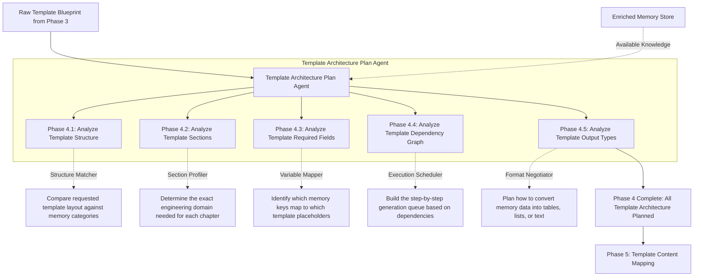

# Phase 4: Template Architecture Planning

This document explains the Template Architecture Planning phase. Once Phase 3 has generated a raw "blueprint" of the empty template, this phase compares that blueprint against the populated Memory Store (from Phase 2). It decides exactly *how* the knowledge will fit into the template before any actual writing begins.

---

## Phase Overview

| Phase | Name | What it does in simple terms | Output Asset |
| :--- | :--- | :--- | :--- |
| **4.1** | **Analyze Template Structure** | Compares the template's broad layout against available memory categories. | Structural Match Log |
| **4.2** | **Analyze Template Sections** | Determines which engineering domain belongs in which specific chapter. | Section Profiles |
| **4.3** | **Analyze Template Required Fields** | Maps specific memory variables to template placeholders. | Variable Mapping Plan |
| **4.4** | **Analyze Template Dependency Graph** | Creates the step-by-step queue of which sections must be generated first. | Execution Schedule |
| **4.5** | **Analyze Template Output Types** | Plans how data will be converted to match the requested format (e.g. text to table). | Formatting Strategy |

---

## Detailed Phase-by-Phase Slides

### Phase 4.1: Analyze Template Structure

1. **What this stage is doing:**
   * It takes the Document Tree created in Phase 3 and cross-references it with the `MEMORY.md` index. It evaluates if the broad layout of the template matches the available knowledge (e.g., if the template has a "Software" section, it checks if Software memories exist).
2. **How it is useful:**
   * It performs a high-level feasibility check before wasting compute resources on detailed mapping.
3. **What is solved in this stage:**
   * **The Total Mismatch Problem:** If a user uploads a Mechanical Engineering template but the memory store only contains pure Software APIs, this stage flags the massive architectural failure immediately.

---

### Phase 4.2: Analyze Template Sections

1. **What this stage is doing:**
   * It dives deeper into the specific chapters identified in Phase 3. It profiles each chapter to determine its exact engineering domain (e.g., matching "Section 3.1: Power Rails" to the `Hardware/Power` memory category).
2. **How it is useful:**
   * It assigns a specific "topic scope" to each chapter, preventing AI writing agents from rambling off-topic.
3. **What is solved in this stage:**
   * **The Topic Bleed Problem:** Prevents software specifications from accidentally being injected into a chapter that is supposed to be strictly about hardware pinouts.

---

### Phase 4.3: Analyze Template Required Fields

1. **What this stage is doing:**
   * It takes the "Shopping List" of empty placeholders from Phase 3 (like `{{CLOCK_SPEED}}`) and searches the Memory Store to find the exact JSON key or markdown file that contains that specific value.
2. **How it is useful:**
   * It creates a hard link between the empty template slot and the exact data source.
3. **What is solved in this stage:**
   * **The Hallucination Problem:** By strictly mapping placeholders to verified memory addresses *before* generation, it prevents the AI from inventing numbers when it actually writes the text.

---

### Phase 4.4: Analyze Template Dependency Graph

1. **What this stage is doing:**
   * It analyzes the DAG built in Phase 3 and creates the actual Execution Schedule. If Chapter B depends on Chapter A, it schedules Chapter A to be processed first and passes its outputs as context to Chapter B.
2. **How it is useful:**
   * It optimizes the generation process, allowing independent sections to be generated in parallel while safely queuing dependent sections.
3. **What is solved in this stage:**
   * **The Race Condition Problem:** Prevents the system from trying to summarize the overall system architecture before the individual subsystems have been planned and mapped.

---

### Phase 4.5: Analyze Template Output Types

1. **What this stage is doing:**
   * It looks at the formatting rules discovered in Phase 3 and formulates a conversion strategy. If the template requires a table, but the memory store has a paragraph, it plans a conversion step.
2. **How it is useful:**
   * It prepares the necessary formatting tools (like markdown table generators) ahead of time.
3. **What is solved in this stage:**
   * **The Format Clash Problem:** Prevents the system from blindly pasting raw paragraphs into a rigid column layout, which would break the final document's readability.

---

## Mentor Notes: Potential Problems & Solutions

### 1. The Bottleneck Dependency
* **The Problem:** In Phase 4.4, if every single chapter depends on "Chapter 1: Executive Summary," the system might process everything sequentially (one by one), making document generation incredibly slow.
* **The Easy Solution:** Use **Deferred Resolution**. Allow the AI to draft Chapters 2 through 10 in parallel using the *raw* Memory Store as context, and then only rewrite the "Executive Summary" at the very end. The DAG should schedule summaries last, not first!
