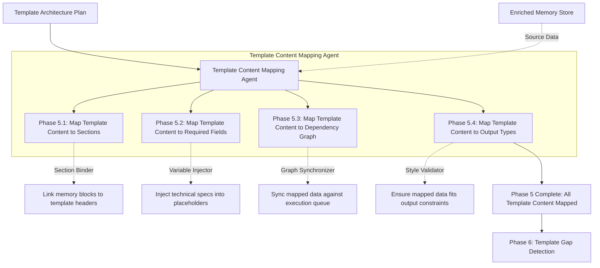

# Phase 5: Template Content Mapping

This document explains the Template Content Mapping phase. This is the stage where the theoretical plan meets the actual data. The system takes the blueprint created in Phase 4 and firmly binds the enriched memories (from Phase 2) into the target template slots.

---

## Phase Overview

| Phase | Name | What it does in simple terms | Output Asset |
| :--- | :--- | :--- | :--- |
| **5.1** | **Map Content to Sections** | Links large memory blocks (like whole chapters) to the template structure. | Section Bindings |
| **5.2** | **Map Content to Required Fields** | Injects specific data points (like voltages or pin numbers) into the blank placeholders. | Field Injections |
| **5.3** | **Map Content to Dependency Graph** | Ensures the injected data honors the generation order (DAG). | Synchronized Graph |
| **5.4** | **Map Content to Output Types** | Verifies the mapped data fits the styling rules (e.g. data fits in the table width). | Validated Styles |

---

## Detailed Phase-by-Phase Slides

### Phase 5.1: Map Template Content to Sections

1. **What this stage is doing:**
   * It takes the structural layout defined in Phase 4 and officially binds the memory markdown files to their corresponding target chapters.
2. **How it is useful:**
   * It bridges the gap between raw knowledge and the final presentation format.
3. **What is solved in this stage:**
   * **The Misplaced Information Problem:** Prevents hardware specs from accidentally bleeding into software configuration chapters.

### Phase 5.2: Map Template Content to Required Fields

1. **What this stage is doing:**
   * It executes the variable injection. It replaces `{{CLOCK_SPEED}}` with the actual `100MHz` value pulled from the memory store.
2. **How it is useful:**
   * It populates the fine details of the document automatically without human copy-pasting.
3. **What is solved in this stage:**
   * **The Manual Entry Error Problem:** Guarantees 100% accuracy between the original extracted spec and the final generated output.

### Phase 5.3: Map Template Content to Dependency Graph

1. **What this stage is doing:**
   * It cross-references the mapped data with the execution queue to ensure no data is injected out of order.
2. **How it is useful:**
   * It acts as a runtime safety check during the mapping process.
3. **What is solved in this stage:**
   * **The Premature Variable Problem:** Prevents variables from being written into sections that haven't received their parent context yet.

### Phase 5.4: Map Template Content to Output Types

1. **What this stage is doing:**
   * It checks if the injected data breaks the formatting constraints.
2. **How it is useful:**
   * Ensures the final output looks professional and doesn't contain massive tables that bleed off the PDF page.
3. **What is solved in this stage:**
   * **The Layout Breakage Problem:** Catches formatting overloads before final assembly.

---

## Mentor Notes: Potential Problems & Solutions

### 1. Data Type Mismatches
* **The Problem:** The template expects a single number (e.g., `5V`), but the memory store contains a paragraph describing the voltage rail. Injecting a paragraph into a small table cell will break the layout.
* **The Easy Solution:** Add a strict semantic type-checker during Phase 5.2. If the placeholder expects a numeric value or a short string, but the memory is a text block, the mapper should invoke an LLM summarizer to condense the block into the required format before injecting it.
