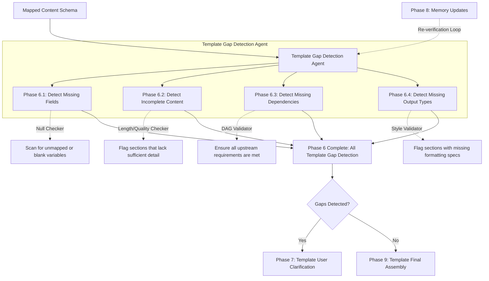

# Phase 6: Template Gap Detection

This document explains the Template Gap Detection phase. This is the ultimate "Quality Assurance" gate in the pipeline. Before generating any actual text, this agent scans the mapped template to ensure every single required detail is present and correct.

---

## Phase Overview

| Phase | Name | What it does in simple terms | Technical Output |
| :--- | :--- | :--- | :--- |
| **6.1** | **Detect Missing Fields** | Scans the template for empty placeholders. | Null/Blank Variable Log |
| **6.2** | **Detect Incomplete Content**| Checks if the mapped memory provides enough detail for the section. | Quality/Length Flag |
| **6.3** | **Detect Missing Dependencies**| Verifies that all upstream variables required by a section are available. | Broken Link Report |
| **6.4** | **Detect Missing Output Types**| Checks if formatting rules are missing for specific sections. | Style Error Log |
| **I7**  | **Decision: Gaps Detected?** | Routes the system based on the gap logs. | Loop Routing (Yes -> Phase 7, No -> Phase 9) |

---

## Detailed Phase-by-Phase Slides

### Phase 6.1: Detect Missing Fields

1. **What this stage is doing:**
   * It performs a rigorous check of all placeholders. If a placeholder was mapped in Phase 5 but the memory store had no data for it (resulting in a blank or null value), this stage flags it.
2. **How it is useful:**
   * It prevents the final document from containing embarrassing blanks like "The required voltage is [INSERT VOLTAGE HERE]."
3. **What is solved in this stage:**
   * **The Null Data Problem:** Ensures absolute data completeness.

### Phase 6.2: Detect Incomplete Content

1. **What this stage is doing:**
   * It evaluates the *quality* of the mapped content. For example, if a "Detailed System Architecture" section only received a single sentence from the memory store, this stage flags it as "Incomplete."
2. **How it is useful:**
   * It guarantees that the final document meets professional depth and length standards.
3. **What is solved in this stage:**
   * **The Superficial Content Problem:** Prevents the generation of bare-bones or heavily unbalanced chapters.

### Phase 6.3: Detect Missing Dependencies

1. **What this stage is doing:**
   * It re-validates the DAG execution queue. It ensures that if Section B relies on a parameter from Section A, that parameter actually exists and was successfully mapped.
2. **How it is useful:**
   * It prevents cascading failures where one missing piece of data ruins multiple downstream chapters.
3. **What is solved in this stage:**
   * **The Broken Chain Problem:** Catches architectural logic flaws before they corrupt the final document.

### Phase 6.4: Detect Missing Output Types

1. **What this stage is doing:**
   * It ensures every section has an assigned style template.
2. **How it is useful:**
   * Prevents formatting engine crashes during the final assembly.
3. **What is solved in this stage:**
   * **The Unformatted Text Problem:** Ensures 100% styling coverage.

### Phase I7: Decision - Gaps Detected?

1. **What this stage is doing:**
   * This is the critical routing node. If any logs or flags were generated in phases 6.1-6.4, it routes the workflow to **Phase 7** to ask the user. If the document is perfect, it skips ahead to **Phase 9**.
   * Crucially, when Phase 8 finishes updating the memory, the system loops *back* to this node to re-verify the document.
2. **How it is useful:**
   * It creates a "Closed-Loop Verification" system.
3. **What is solved in this stage:**
   * **The Incomplete Feedback Loop Problem:** Guarantees that user answers actually solve the gaps before compiling.

---

## Mentor Notes: Potential Problems & Solutions

### 1. The Endless Clarification Loop
* **The Problem:** If a user provides an answer in Phase 7, but the answer is too short and fails the "Detect Incomplete Content" check in Phase 6.2 *again*, the system will loop infinitely, frustrating the user.
* **The Easy Solution:** Add a loop counter and a bypass toggle. If the system hits the same gap twice, it should lower its strictness threshold or present the user with a specific "Skip & Leave Blank" option to intentionally bypass the gate.
