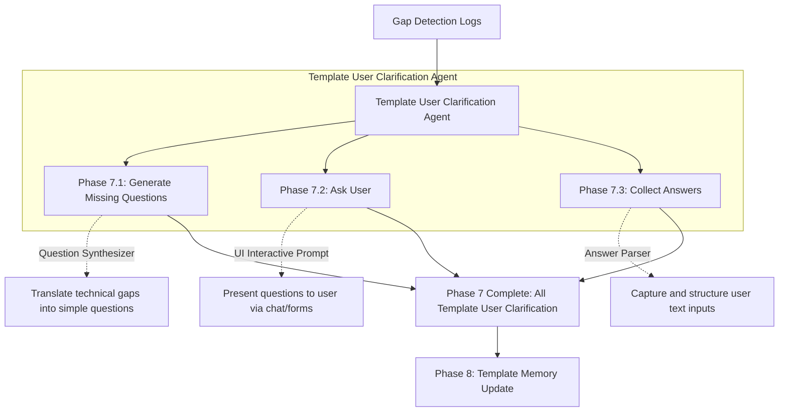

# Phase 7: Template User Clarification

This document explains the Template User Clarification phase. When Phase 6 detects that the system cannot autonomously complete the document due to missing data, this phase engages the human expert to provide the missing pieces.

---

## Phase Overview

| Phase | Name | What it does in simple terms | Output Asset |
| :--- | :--- | :--- | :--- |
| **7.1** | **Generate Missing Questions** | Translates technical gaps into clear, human-readable questions. | Questionnaire |
| **7.2** | **Ask User** | Presents the questions via a chat interface or form. | Interactive Prompt |
| **7.3** | **Collect Answers** | Captures the user's input and readies it for the memory store. | Raw User Answers |

---

## Detailed Phase-by-Phase Slides

### Phase 7.1: Generate Missing Questions

1. **What this stage is doing:**
   * It takes the raw gap logs (e.g., `MISSING: memory/system/clock_speed_hz`) and uses an LLM to rewrite them into friendly, understandable questions like: "What is the primary system clock speed in Hz?"
2. **How it is useful:**
   * It prevents the user from having to interpret raw JSON logs or system variable names.
3. **What is solved in this stage:**
   * **The Technical Translation Problem:** Makes the system accessible to project managers or non-developers who are filling out the forms.

### Phase 7.2: Ask User

1. **What this stage is doing:**
   * It halts the automated pipeline and presents the questionnaire to the user.
2. **How it is useful:**
   * It establishes the interactive, collaborative nature of the AI agent.
3. **What is solved in this stage:**
   * **The Guessing Game Problem:** Prevents the AI from hallucinating or guessing critical hardware specifications when data is missing.

### Phase 7.3: Collect Answers

1. **What this stage is doing:**
   * It captures the free-text responses from the user, performs basic sanitization, and structures them into a payload.
2. **How it is useful:**
   * It prepares the messy human input into a format that Phase 8 can inject directly into the markdown memory files.
3. **What is solved in this stage:**
   * **The Input Formatting Problem:** Cleans up typos or conversational text ("The clock speed should be about 100MHz") before saving it.

---

## Mentor Notes: Potential Problems & Solutions

### 1. Overwhelming Question Volume
* **The Problem:** If a completely blank 100-page template is uploaded with no corresponding memory files, Phase 7 might generate 500 questions at once, overwhelming the user.
* **The Easy Solution:** Implement **Progressive Disclosure** or **Batching**. Limit the clarification agent to ask a maximum of 5-10 critical questions at a time. Once those are answered and integrated, move to the next batch. This keeps the user experience smooth and manageable.
