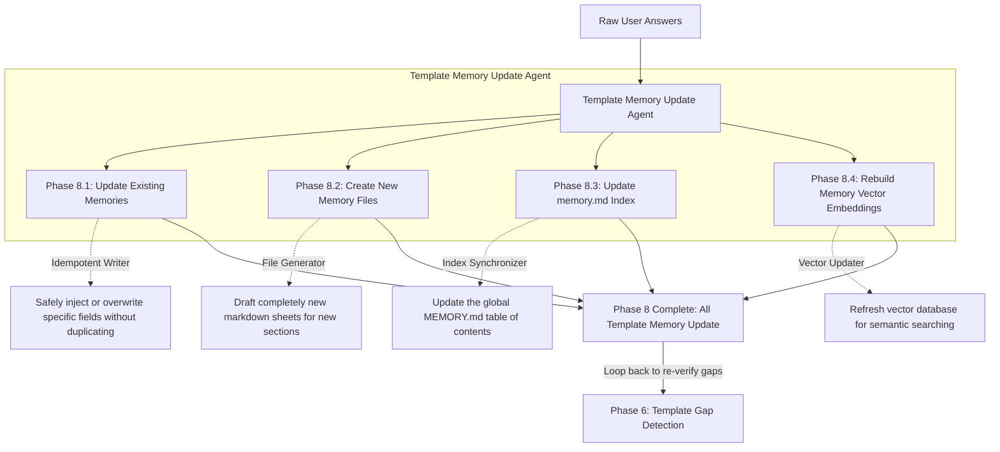

# Phase 8: Template Memory Update

This document explains the Template Memory Update phase. After the user provides clarifications in Phase 7, this agent integrates those answers deeply into the system's memory banks, ensuring the data is permanently saved and ready for the gap re-verification loop.

---

## Phase Overview

| Phase | Name | What it does in simple terms | Output Asset |
| :--- | :--- | :--- | :--- |
| **8.1** | **Update Existing Memories** | Modifies existing markdown sheets with the new values. | Updated `.md` Files |
| **8.2** | **Create New Memory Files** | Drafts entirely new memory files if the user introduced a new topic. | New `.md` Files |
| **8.3** | **Update memory.md Index** | Refreshes the global directory table of contents. | `MEMORY.md` |
| **8.4** | **Rebuild Vector Embeddings** | Updates the search database so new answers are easily searchable. | Vector Store DB |
| **Loop**| **Route to Phase 6** | Sends the workflow back to Gap Detection. | Security Loop |

---

## Detailed Phase-by-Phase Slides

### Phase 8.1: Update Existing Memories

1. **What this stage is doing:**
   * It takes the structured user answers and injects them into the specific existing memory markdown files.
2. **How it is useful:**
   * It enriches the knowledge base without creating messy duplicate files.
3. **What is solved in this stage:**
   * **The Outdated Knowledge Problem:** Keeps the memory store dynamically updated as the project evolves.

### Phase 8.2: Create New Memory Files

1. **What this stage is doing:**
   * If a user's answer describes an entirely new subsystem (e.g., a new "Bluetooth Module" was added to the spec), this agent generates a brand new memory file from scratch.
2. **How it is useful:**
   * It handles scope creep and expands the architecture plan dynamically.
3. **What is solved in this stage:**
   * **The Missing File Problem:** Prevents data from being dropped just because a folder didn't previously exist.

### Phase 8.3: Update memory.md Index

1. **What this stage is doing:**
   * It scans the entire memory store directory and updates the `MEMORY.md` master index file with links to any new or renamed files.
2. **How it is useful:**
   * It acts as a directory map so other agents can easily navigate the file system.
3. **What is solved in this stage:**
   * **The Dead Link Problem:** Ensures that all cross-references in the system are valid.

### Phase 8.4: Rebuild Vector Embeddings

1. **What this stage is doing:**
   * It runs the updated markdown files through an embedding model and saves the numerical vectors to a local database.
2. **How it is useful:**
   * It allows the system to perform semantic searches (e.g., finding "wireless communication" when the file says "Bluetooth").
3. **What is solved in this stage:**
   * **The Searchability Problem:** Ensures the newest user answers are immediately searchable by the writing agents in Phase 9.

### Loop: Route to Phase 6

1. **What this stage is doing:**
   * After all saves are complete, this node actively routes the pipeline *back* to Phase 6 (Template Gap Detection).
2. **How it is useful:**
   * It re-runs the Gap Detectors to formally verify that the user's answers actually solved the problem.
3. **What is solved in this stage:**
   * **The Incomplete Answer Problem:** If the user provided a bad or incomplete answer, the system catches it again before trying to assemble a broken document.

---

## Mentor Notes: Potential Problems & Solutions

### 1. State Corruption (The Duplication Problem)
* **The Problem:** If this loop runs three times, a poorly designed agent might write the user's answer into the file three separate times, corrupting the document.
* **The Easy Solution:** Design your memory writers to be **Idempotent**. "Idempotency" is a fancy word that means: "No matter how many times you run this function, the result remains the same." Use strict JSON key replacements rather than simple text appends. If the `CLOCK_SPEED` key already exists, overwrite it; don't add a second one.
