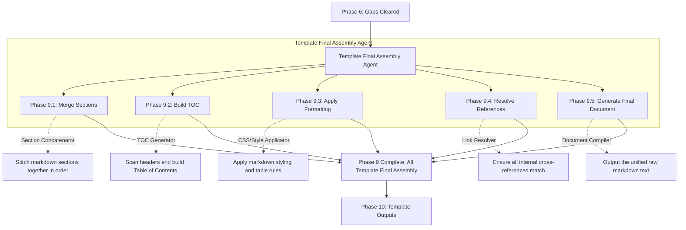

# Phase 9: Template Final Assembly

This document explains the Template Final Assembly phase. Once all content is mapped and the Gap Detection gate confirms everything is 100% complete, this phase takes over. It acts as the final "Book Binder," stitching all individual pieces into a single, cohesive document.

---

## Phase Overview

| Phase | Name | What it does in simple terms | Output Asset |
| :--- | :--- | :--- | :--- |
| **9.1** | **Merge Sections** | Concatenates all individual memory markdown files in the correct order. | Raw Merged Draft |
| **9.2** | **Build TOC** | Scans the merged draft and automatically generates a Table of Contents. | TOC Block |
| **9.3** | **Apply Formatting** | Enforces consistent markdown styling (headers, bolding, table spacing). | Styled Draft |
| **9.4** | **Resolve References** | Fixes internal links so clicking a reference jumps to the right section. | Linked Draft |
| **9.5** | **Generate Final Document** | Outputs the absolute final version of the unified text. | Final Markdown Text |

---

## Detailed Phase-by-Phase Slides

### Phase 9.1: Merge Sections

1. **What this stage is doing:**
   * It takes the ordered list of files produced by the DAG schedule in Phase 4 and pastes their contents sequentially into a single massive text buffer.
2. **How it is useful:**
   * It physically creates the book from the chapters.
3. **What is solved in this stage:**
   * **The Disjointed File Problem:** Replaces hundreds of tiny memory files with one easily readable specification sheet.

### Phase 9.2: Build TOC

1. **What this stage is doing:**
   * It scans the merged buffer for Markdown headers (e.g., `#`, `##`, `###`) and compiles a hierarchical Table of Contents at the top of the document.
2. **How it is useful:**
   * It makes the massive document navigable.
3. **What is solved in this stage:**
   * **The Navigation Problem:** Prevents the user from having to scroll blindly through 100 pages of text to find a specific hardware pinout.

### Phase 9.3: Apply Formatting

1. **What this stage is doing:**
   * It runs a linter or formatting script over the text to ensure uniformity. For example, it ensures all tables have standard markdown pipes `|` and all headers have the correct spacing.
2. **How it is useful:**
   * It gives the document a highly professional polish.
3. **What is solved in this stage:**
   * **The Visual Clutter Problem:** Fixes ugly text wrapping or broken tables caused by different LLMs generating slightly different markdown styles.

### Phase 9.4: Resolve References

1. **What this stage is doing:**
   * It finds internal reference tags (like `[See Section 4.2]`) and updates them so they correctly link to the actual generated anchor tags in the document.
2. **How it is useful:**
   * It makes the document interactive and traceable.
3. **What is solved in this stage:**
   * **The Dead Link Problem:** Ensures cross-references aren't broken when sections are re-numbered during merging.

### Phase 9.5: Generate Final Document

1. **What this stage is doing:**
   * It finalizes the text buffer and saves it to the disk as the golden master copy.
2. **How it is useful:**
   * This is the final phase before the document leaves the internal system.
3. **What is solved in this stage:**
   * **The Finalization Problem:** Locks the draft so no further autonomous agents can modify the text.

---

## Mentor Notes: Potential Problems & Solutions

### 1. Memory Bloat during Merging
* **The Problem:** If you are building a 1,000-page document, loading all the text strings into your system's RAM at once during "Merge Sections" can crash the script (Memory Error).
* **The Easy Solution:** Use **Streaming** or **File Appending**. Instead of holding the entire document in memory, open a target file and append (`>>`) each section to the bottom of the file one-by-one. This keeps your RAM usage near zero, no matter how large the document gets.
